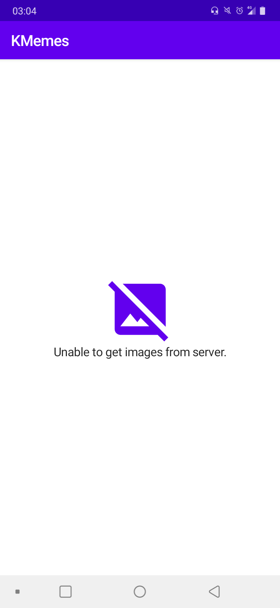

## About

Simple project that loads images from Firebase Cloud Storage, focusing on the new modern toolkit for creating Android declarative UIs, [Jetpack Compose](https://developer.android.com/jetpack/compose). The project also follows the [MVVM](https://developer.android.com/jetpack/guide) architecture with **ViewModel** and **LiveData**.

  
  

## Clone

If you want to clone and test this project, you must first have a Firebase account and connect to your project. Follow these steps:

- [Login to Firebase](https://console.firebase.google.com) and then create a project with any name, following all the steps described on the website during creation.
- Link your app to the Firebase console by adding the package name used in this project (**com.kproject.kmemes**, or your own if you have modified it).
- SHA-1 is not required for this project, but you can add it if you wish.
- Download and insert the **google-services.json file into the app module root of the project**, as mentioned in the Firebase configuration steps.
- If you wish, follow the [official guide](https://firebase.google.com/docs/android/setup) for project setup or more information.
- With the Firebase project properly connected to your Android Studio project, open the **Storage** option and create a folder named **images**. If you want to create a folder with another name, like **memes**, for example, modify the getImages() method of the [ImageRepository](https://github.com/jsericksk/KMemes/blob/main/app/src/main/java/com/kproject/kmemes/repository/ImageRepository.kt) class, so it lists all images in *memes* and not *images*.
Finally, upload your memes/images to this folder and compile the project for testing.

## Important notes

1. The project uses the library [lifecycle-viewmodel-compose](https://developer.android.com/jetpack/androidx/releases/lifecycle#lifecycle_viewmodel_compose_2) which is still in alpha version.
2. The component [LazyVerticalGrid](https://developer.android.com/reference/kotlin/androidx/compose/foundation/lazy/package-summary#LazyVerticalGrid(androidx.compose.foundation.lazy.GridCells,androidx.compose.ui.Modifier,androidx.compose.foundation.lazy.LazyListState,androidx.compose.foundation.layout.PaddingValues,kotlin.Function1)) is also used, which is still experimental. The documentation recommends using **LazyColumn** and **Row** to achieve the same result.
3. To get the image's download URL, you need a call to the downloadUrl method, which is asynchronous. This means that ***for every image you have on Storage, a request will be made to get your download URL***. In addition to taking a long time to get all the URLs, a high cost of unnecessary traffic is generated in the project, depending on the quantity and file size of the images. That said, it's recommended that you don't upload too many images to the Firebase project so you don't have too much delay getting their URLs into the app.

All this was done for study purposes only.

## Uses

[Coil](https://coil-kt.github.io/coil/compose/): for loading images.  
[Coroutines](https://developer.android.com/kotlin/coroutines): for Firebase access.  
[Navigation with Compose](https://developer.android.com/jetpack/compose/navigation): for navigating between Composable screens using Compose's Navigation component.  

**Jetpack Compose supremacy!** 🧎
